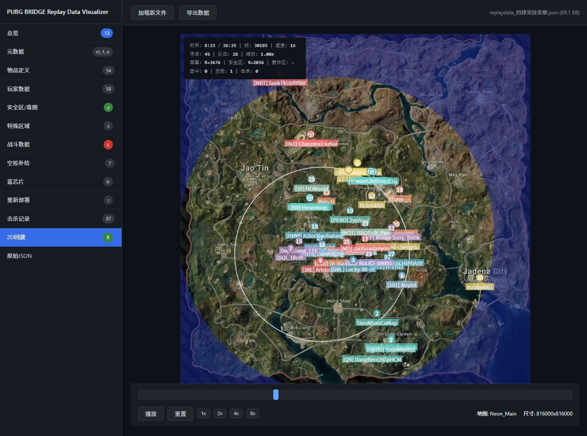

# PUBG BRIDGE Replay Analyzer

解析 PUBG BRIDGE 回放数据，并提供可视化查看。



## 功能

- **解析回放数据** - 将压缩的回放数据转换为可读的 JSON
- **数据可视化** - 直观查看玩家、击杀、空投、刷圈等数据
- **2D 回放** - 复刻了PUBG BRIDGE 2D回放的绝大多数功能

## 使用方法

### 解析回放数据

```bash
python parse_replay.py replaydata.json
```

### 可视化查看

打开 `visualizer.html`，把原始或解析后的 JSON 拖进去即可。

支持的功能：

- 事件可视化
- 2D回放

## 文件说明

| 文件                | 说明    |
| ----------------- | ----- |
| `parse_replay.py` | 解析脚本  |
| `visualizer.html` | 可视化页面 |
| `demo/`           | 示例数据  |

## 数据来源

回放数据来自PUBG BRIDGE：
```
https://bridge.pubg.com/api/v1/web-replay/replays/{replay_match_id}
```
与PUBG API的遥测API无关。

## 声明

本项目与 Krafton 及其关联公司无关，相关图片、图标和商标均属于其各自所有者。  
本项目仅供学习和研究，不得用于非法用途。

## License

MIT
